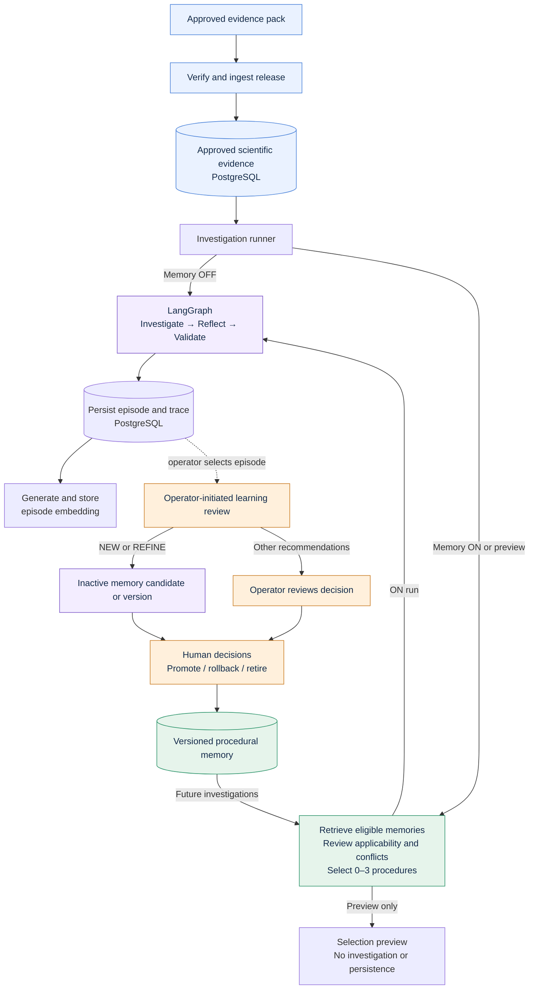

# AMSL | System Architecture

This overview is intended for the README. For implementation details, see [Process Flow](process_flow.md).

```mermaid
flowchart TB
  PACK["Approved evidence pack"] --> ING["Verify and ingest release"] --> SCI[("Approved scientific evidence<br/>PostgreSQL")]
  SCI --> RUN["Investigation runner"]
  RUN -->|Memory OFF| INV["LangGraph<br/>Investigate → Reflect → Validate"]
  RUN -->|Memory ON or preview| RET["Retrieve eligible memories<br/>Review applicability and conflicts<br/>Select 0–3 procedures"]
  RET -->|ON run| INV
  RET -->|Preview only| PRE["Selection preview<br/>No investigation or persistence"]
  INV --> SAVE[("Persist episode and trace<br/>PostgreSQL")]
  SAVE --> EMB["Generate and store<br/>episode embedding"]
  SAVE -. "operator selects episode" .-> REV["Operator-initiated learning review"]
  REV -->|NEW or REFINE| DRAFT["Inactive memory candidate or version"]
  REV -->|Other recommendations| ACT["Operator reviews decision"]
  DRAFT --> HUMAN["Human decisions<br/>Promote / rollback / retire"]
  ACT --> HUMAN
  HUMAN --> MEM[("Versioned procedural memory")]
  MEM -->|Future investigations| RET

  classDef scientific fill:#eaf2ff,stroke:#447ed8,color:#142b4b;
  classDef memory fill:#e6f4eb,stroke:#299268,color:#142b4b;
  classDef investigation fill:#f3edff,stroke:#7953c7,color:#142b4b;
  classDef human fill:#fff0dc,stroke:#ca7b22,color:#142b4b;
  class PACK,ING,SCI scientific;
  class RET,MEM memory;
  class INV,DRAFT investigation;
  class REV,ACT,HUMAN human;
```
